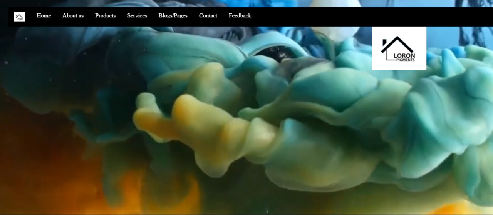
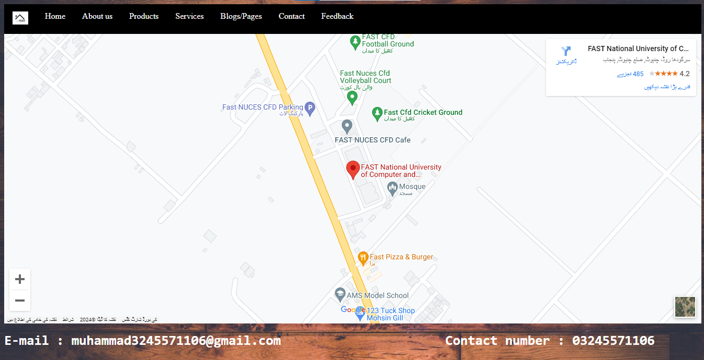
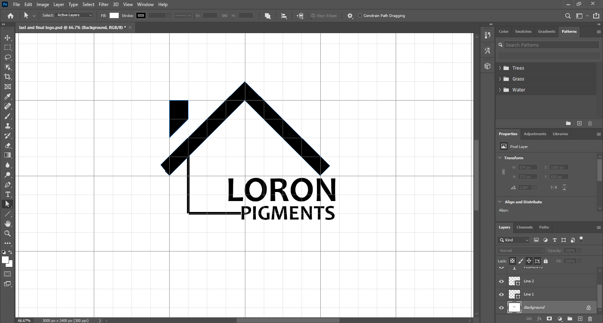
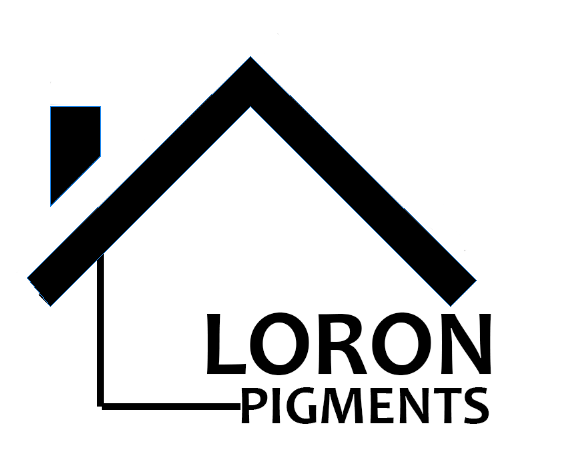
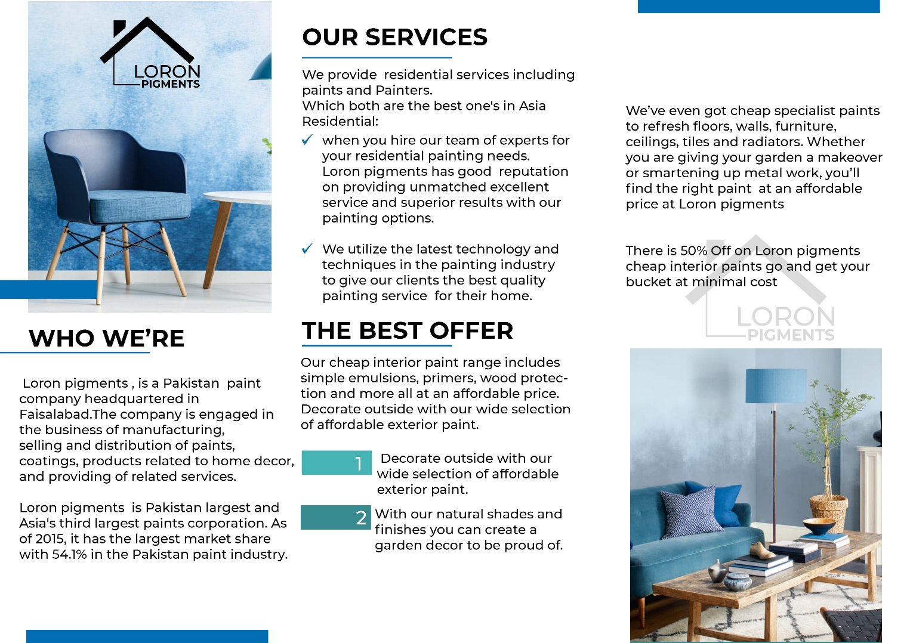

# Loron Pigments - Paint selling website using HTML and CSS
Loron Pigments is a website for selling paints and showcasing live samples of paints to users so that they can make decisions easily.
It gives paints, primers, and painters for homes.
I developed this website using HTML and made it look nice using CSS.

User can come to the website, see the colors and their textures, and contact us or come to our office as a Google map of our office is also included.

## FEATURES OF WEBSITE
The website includes some of these features:
* HOME PAGE: As the main represented page of the website.
* ABOUT US: for adding company information.
* PRODUCTS: for displaying products of the company to clients.
* SERVICES: for showing the company’s services to a customer visiting the website.
* BLOGS/PAGES: for showing social media links of the company.
* CONTACT: for adding contacts of the company and enabling the customer to contact the company for placing orders.
* FEEDBACK: for having feedback from clients about the company’s services and goods.

> I aimed to make a website for a painting company that provides paints and painters for homes. I will add services and details about our company so clients can get aware of us. My contact numbers and related information will be added so our clients can place their orders conveniently by having a look at our products displayed on the website. I will also add my location and social handles for clients so they can feel free to contact me wherever they want.

<b>LOGO</b>: The logo is planned while keeping in view the essential point of organization which is to give paints and painters to homes.
I've designed logo utilizing Adobe Photoshop (notable programming for altering), and taken advantage of its tools including pen tool, path tool, textbox tool, grid view, etc.

The logo with its structure represents a home and the name pigment means color. Aggregately it speaks to the genuine point of organization which is to give paint and painters to homes.

<b>FLYER</b>: A flyer is planned with extraordinary exertion alongside the expansion of some organization's data and the best arrangement offered by the organization and administrations that the organization gives. The plan is made utilizing the shape tool, layers option, text box tool,  and so on of Adobe Photoshop. Some significant parts of the organization are remembered for it alongside the important logo and some venture pictures of the organization. A best-given proposal by the organization is likewise included in the flyer so it can turn out to be more alluring and considerate when looking for a client.

* HOME PAGE: The home page consists of buttons to shift pages along with the logo and a cinematic shot video in the background.
* About Us: In About Us, we have examined our organization and its status alongside the conversation of its aims and perspectives. 
* PRODUCTS: We have displayed some of our products along with their reference codes imprinted on them so customers can place orders easily by contacting us through email or the contact number provided on the website.
* SERVICES: In administrations, we have demonstrated what we are planning to give to our customers. We have indicated how our groups guarantee the extraordinary and up to check work with the least costs when contrasted with different organizations. 
We have told you about our high-level strategies for completing the work. 
Alongside the quality, we have an amount too which is likewise talked about in a similar area.
* BLOGS/PAGES: In this segment, we have added a portion of our web-based media connections and pages so our customers can visit them by basically tapping on the separate symbols of those locales.
* CONTACT: In this part, we have shared our contact number and email with our customers to settle on their decision for putting requests to fill their homes with colors.
* FEEDBACK: We have added a feedback segment so we can get our client surveys about our administrations and items which we use to improve the norms of our organization and are the essential final proposal of our prosperity. We profoundly acknowledge and honor our client audits. The customer simply has to enter his name, email, and contact number, write his/her reviews in a section given, and submit it.
